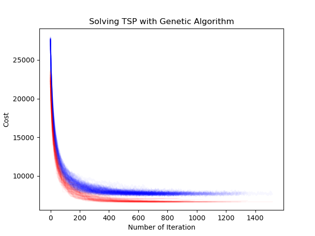

# tsp-meta-heuristic
Python implementation of Tabu Search (TB), Genetic Algorithm (GA), and Simulated Annealing (SA) solveing Travelling Salesman Problem (TSP). Term project of Intelligent Optimization Methods, UCAS course [070105M05002H](http://jwxk.ucas.ac.cn/course/courseplan/184399).

禁忌搜索, 遗传算法, 模拟退火解旅行商问题的Python实现. 中国科学院大学现代智能优化方法大作业.

# Requirements

- python 3.8.3

# Getting Started

Test data `dj38.txt` can be found in [Djibouti - 38 Cities](http://www.math.uwaterloo.ca/tsp/world/countries.html#DJ).

Get optimal tour length from better tsp solver, e.g. [Gurobi](https://www.gurobi.com/documentation/9.1/examples/tsp_py.html), and replace `opt_cost` in `main.py` with that result so that we can calculate the optimality gap.

Change `method` to either `'ts'`,  `'ga'`, or `'sa'` in `main.py`.  Run the code.

Check the results in `/results/`.

Note:

1. If running with simulated annealing, you can run `init_temp.py` first to get the initial temperature (see [Ben-Ameur, W. (2004)](https://link.springer.com/article/10.1023/B:COAP.0000044187.23143.bd)).
2. If you want to visualize the optimization process of simulated annealing with gif, set `num_test` to 1. (This may take a very long time.)

# Algorithm Details

In Genetic Algorithm, the crossover and mutation operators are Order 1 Crossover (often referred to as OX or Order Crossover) and Center Inverse Mutation (CIM), respectively. They are chosen because of the conclusion in the article [A Comparison of GA Crossover and Mutation Methods for the Traveling Salesman Problem](https://link.springer.com/chapter/10.1007/978-981-15-6067-5_60).

# Experiments

Experimental results are shown as follows. The unit of time is seconds.

## Tabu Search

| tb_size | max_tnm | best_cost (best_gap) | avg_cost (avg_gap) | cost_std  | avg_time  | time_std  |
| :-----: | :-----: | :-----------------------: | :---------------------: | :-------: | :-------: | :-------: |
|   20    |   100   |      **6659.4 (0%)**      |   **6701.7 (0.63%)**    | **71.36** |   0.228   |   0.068   |
|   20    |   300   |      **6659.4 (0%)**      |      6748.7 (1.3%)      |   179.5   |   0.556   |   0.15    |
|   80    |   100   |      **6659.4 (0%)**      |      6888.2 (3.4%)      |   187.7   | **0.196** | **0.050** |
|   80    |   300   |      **6659.4 (0%)**      |     6704.6 (0.68%)      |   100.5   |   0.531   |   0.077   |

## Genetic Algorithm

| n_pop | r_cross | r_mut | max_tnm | best_cost (best_gap) | avg_cost (avg_gap) | cost_std  | avg_time | time_std |
| :---: | :-----: | ----- | :-----: | :-----------------------: | :---------------------: | :-------: | :------: | :------: |
|  200  |   0.5   | 0.8   |    3    |      **6659.4 (0%)**      |     6686.8 (0.41%)      |   97.58   |   5.69   |   1.2    |
|  200  |   0.5   | 0.8   |   10    |      **6659.4 (0%)**      |   **6680.1 (0.31%)**    | **46.20** | **4.02** | **0.85** |
|  500  |   0.5   | 0.8   |    3    |      **6659.4 (0%)**      |     6682.2 (0.34%)      |   86.06   |   10.6   |   2.3    |

## Simulated Annealing

| tb_size | max_tnm | t_0 (chi_0) | alpha | best_cost (best_gap) | avg_cost (avg_gap) | cost_std  | avg_time  | time_std  |
| :-----: | :-----: | ---------------- | ----- | :-----------------------: | :---------------------: | :-------: | :-------: | :-------: |
|    0    |   10    | 1200 (0.7)       | 0.9   |      **6659.4 (0%)**      |     6681.1 (0.32%)      |   86.43   | **0.255** | **0.027** |
|    0    |   10    | 1200 (0.7)       | 0.95  |      **6659.4 (0%)**      |      6729.2 (1.0%)      |   265.5   |   0.381   |   0.074   |
|    0    |   10    | 4000 (0.9)       | 0.9   |      **6659.4 (0%)**      |     6685.3 (0.39%)      |   94.12   |   0.298   |   0.031   |
|    0    |   10    | 4000 (0.9)       | 0.95  |      **6659.4 (0%)**      |      7334.9 (10%)       |   825.6   |   0.340   |   0.17    |
|    0    |   20    | 1200 (0.7)       | 0.9   |      **6659.4 (0%)**      |   **6660.7 (0.019%)**   | **9.518** |   0.445   |   0.061   |
|    0    |   20    | 1200 (0.7)       | 0.95  |      **6659.4 (0%)**      |     6716.5 (0.86%)      |   125.7   |   0.569   |   0.19    |
|    0    |   20    | 4000 (0.9)       | 0.9   |      **6659.4 (0%)**      |     6666.3 (0.10%)      |   35.68   |   0.491   |   0.070   |
|    0    |   20    | 4000 (0.9)       | 0.95  |      **6659.4 (0%)**      |      6857.6 (3.0%)      |   201.6   |   0.526   |   0.25    |
|   20    |   20    | 1200 (0.7)       | 0.9   |      **6659.4 (0%)**      |     6666.1 (0.10%)      |   39.44   |   0.463   |   0.062   |
|   40    |   20    | 1200 (0.7)       | 0.9   |      **6659.4 (0%)**      |     6671.1 (0.18%)      |   64.43   |   0.488   |   0.064   |

# License

MIT

# Acknowledgments

Intelligent Optimization Methods, UCAS course [070105M05002H](http://jwxk.ucas.ac.cn/course/courseplan/184399)
